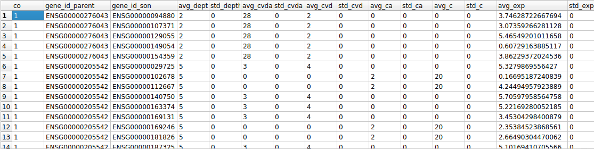

Ricardo Project - Machine Learning
==================================

Project tree
------------

```
├── analysis
│   ├── code
│   │   ├── data                        # Scripts to edit expression data
│   │   ├── models
│   │   │   ├── decision_tree_gtex      # Decision trees using GTEx data
│   │   │   ├── decision_tree_iguaracy  # Decision trees using HCAEC data
│   │   │   ├── kmeans_gtex             # Kmeans using GTEx data
│   │   │   ├── kmeans_iguaracy         # Kmeans using HCAEC data
│   │   │   └── pca_gtex                # PCA applied to GTEx data
│   │   ├── sql                         # Scripts to modify or update SQL database
│   │   └── viz                         # Scripts to visualize results 
│   └── results                         # Printed results from trees, visualizers, etc
│       ├── gtex_results
│       └── iguaracy_results
├── data
│   └── external                        # External data
├── interim                             # Intermediate data
│   ├── gtex_data
│   ├── iguaracy_data
│   └── sql                             # Database created
├── processed                           # Final data for input to algorithms
│   ├── gtex_data
│   └── iguaracy_data
├── raw                                 # Raw data
│   ├── gtex
│   ├── iguaracy_data
│   └── starnet
├── docs                                # Documents necessary for the project
│   └── papers                          # Papers read for project
├── presentations                       # Presentations from meetings and congresses
│   ├── Imagens e vídeos
│   ├── Krieger Meetings
│   ├── Lab meetings
└── README.md

```

This project aims to identify genes whose pattern of gene expression is determinant to characterize different risk factors for endothelial dysfunction and development of atherosclerosis.

The following image shows a short pipeline for working with GTEx data and applying it to decision trees algorithm. The necessary data for scripts to work are in the data/interim/gtex_data folder.


Decision Tree
-------------

For running the "apply_decision_tree_gtex.py" script, change the values of the "exper" variable to the description of the experiment you are running and of "n_times_run" to how many trees you want to generate.
Make sure to use a GTEx dataframe separated in the CVDA, CVD, CA and C classes.

SQL Database
------------

The database is structured in tables that contain useful information extracted from generated trees and some temporary tables for executing select queries faster. 
The following image shows the ER Diagram of the database.


Useful SQL querys
-----------------

For selecting the most frequent pairs of genes in the generated trees, here are some useful querys to use:

Create TEMP table for experiment ran with GTEx data:
```sql
CREATE TABLE TEMP_gene_id42 AS
   SELECT COUNT(father_and_son_nodes_id) AS co,
          gene_id_parent,
          gene_id_son,
          AVG(depth) AS avg_depth,
          STDEV(depth) AS std_depth,
          AVG(CVDA_son) AS avg_cvda,
          STDEV(CVDA_son) AS std_cvda,
          AVG(CVD_son) AS avg_cvd,
          STDEV(CVD_son) AS std_cvd,
          AVG(CA_son) AS avg_ca,
          STDEV(CA_son) AS std_ca,
          AVG(C_son) AS avg_c,
          STDEV(C_son) AS std_c,
          AVG(expression_value) AS avg_exp,
          STDEV(expression_value) AS std_exp
          FROM father_and_son_nodes AS tbl1
          WHERE experiencia_id = 42
     GROUP BY gene_id_parent, gene_id_son
     ORDER BY COUNT(father_and_son_nodes_id), gene_id_parent DESC;
```
Example of result: 

Selecting, from the TEMP table, pairs of genes that appeared the most on the experiment:

```sql
SELECT DISTINCT tbl1.co,
      gen1.gene_symbol AS parent,
      gen2.gene_symbol as son,
      tbl1.avg_depth,
      tbl1.std_depth,
      tbl1.avg_cvda,
      tbl1.std_cvda,
      tbl1.avg_cvd,
      tbl1.std_cvd,
      tbl1.avg_ca,
      tbl1.std_ca,
      tbl1.avg_c,
      tbl1.std_c,
      tbl1.avg_exp,
      tbl1.std_exp
      FROM TEMP_gene_id42 AS tbl1
INNER JOIN gene AS gen1 ON tbl1.gene_id_parent = gen1.gene_name
INNER JOIN gene as gen2 ON tbl1.gene_id_son = gen2.gene_name
ORDER BY co DESC;
```
Example of result: 